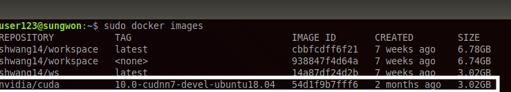
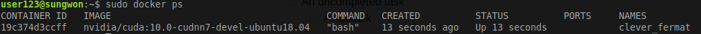
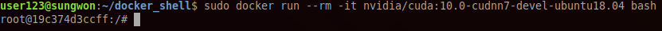
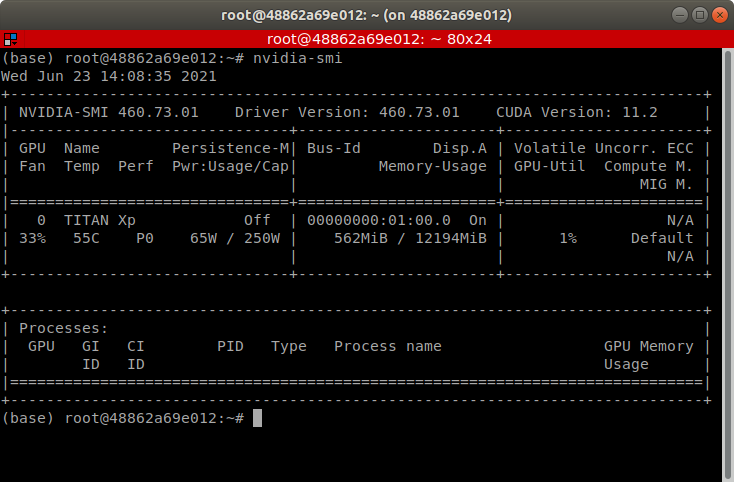

# How to use Docker for your ML Dev Environment

An introductory document of how to adopt docker to your developing environments.
[Link to Docker installation manual](https://docs.docker.com/engine/install/ubuntu/)

## Table of Contents
[1. What is Docker & Why it's Essential?](#sec1)

[2. Images and Containers: What they are, how to use, and how to manage](#sec2)
* [2-A. Definitions: Images and Containers](#sec2a)
* [2-B. Pulling images from Docker Hub](#sec2b)
* [2-C. Loading an image to a container](#sec2c)
* [2-D. Saving changes in a container to an image](#sec2d)
* [2-E. Rolling back to previous containers](#sec2e)
* [2-F. Linking host machine's directory inside the container](#sec2f)

[3. Nvidia-Docker: Connecting GPUs to docker containers](#sec3)

[4. X11: Connecting Docker containers to Graphic User Interfaces](#sec4)

[5. Docker Hub: Managing your Images in Cloud](#sec5)
* [5-A. Pushing an image to Docker Hub](#sec5a)
* [5-B. Pulling an image from Docker Hub](#sec5b)

## 1. What is Docker & Why it's Essential?

[Introduction to Docker](Docker_Workshop.pdf)

## 2. [**Images and Containers**] What they are, how to use, and how to manage

### A. Definitions: Images and Containers

- - - -

**Image** is a SINGLE file that contains everything of your virtual OS environment. It's easy to think of it as an *.iso* file.

**Container** is an INSTANCE of image that is loaded on docker for an interactive use of the image by the users. The difference between container and image is that *virtual OS in the container can be interactively changed by the user ONLINE*, whereas *image can be changed only when we **commit** the working (and thus have interactively edited) container to the image.*

### B. Pulling images from Docker Hub

- - - -

**Docker hub** is an open platform where any users or official software providers can publish their images. We can also upload images for public use (will later be discussed), and here comes the beauty of Docker: We can use officially released images that are **already set up with every version of the software we need**. 

For example, here's how you can get docker image with very specific version of CUDA, and OS. Let's say, we want to get: **Ubuntu 18.04**, **CUDA 10.0**, and **cuDNN 7** with **a single command line.**

1. Go to [Docker Hub](https://hub.docker.com)

2. Search for *cuda* at the top left.

3. Click for *nvidia/cuda* (Official docker image releases by Nvidia)

4. Search for the specific version you want (Note: get *devel* version for full configurations)

5. On the right, you can find and copy a command line to pull the image. For example,

`$ docker pull nvidia/cuda:10.0-cudnn7-devel-ubuntu18.04`

6. Once you pull the image using the command line, you can verify that the image has been downloaded by typing

`$ docker images`

### C. Loading an image to a container

- - - -

Now you have the image you want, let's see how you can use the image, or **how to load an image to a container.**

`$ docker run -it nvidia/cuda:10.0-cudnn7-devel-ubuntu18.04 bash`

`docker run` is the main command to run an image received from the argument. `-it` means that you want to explore the container with 'i'terative 't'erminal.

Done! Now you are inside the OS with dependencies safely and fully installed with just a few lines.

### D. Saving changes in a container to an image

- - - -

Let's say you've edited whatever inside the container (ex. Installing auxiliary packages, saving files, etc.). However, if you just leave the container with `exit` command in terminal, changes you made will not be saved in the image.

In order to save the changes into the image, you must **commit** the container to an image. The image being committed can either be the same image or it can be a new image name you define. To commit, you can do

`$ docker commit $(CONTAINER ID) $(IMAGE_NAME):$(IMAGE_TAG)`

You can check the container ids in two ways

1. `$ docker ps` will show the list of ids of *active containers*.

2. The container ID can be identified inside the interactive terminal as well.

You can either commit the container to the same image name

`$ docker commit 19c374d3ccff nvidia/cuda:10.0-cudnn7-devel-ubuntu18.04`

Or you can commit it to a new image 
`$ docker commit 19c374d3ccff shwang14/ws:latest`

Now, your image is updated with changes you made inside the container.

**Tip**: Of course, if you want to cancel whatever you edited inside the container (ex. tried to install something and it doesn't work and broke the OS), you can just exit the container and re-load the original image!

#### E. Rolling back to previous containers

- - - -

Let's say you forgot to commit your container to an image, or you want to re-create the container you made a week ago. Docker allows you to do those. **There will be no circumstances where you have to re-install your OS**

1. `$ docker ps -a` shows you all the stopped containers you have runned.

2. Simply re-start one of the stopped containers you want to revive using `docker start`.

`$ docker start $(container_id)`

#### F. Linking host machine's directory inside the container.

- - - -

For cases like below, you may want to link your host machine's directory inside the container, so that **you can navigate a certain directory of your host machine INSIDE the container.**

* Collaborators want to share a single developing environment but not the code scripts (workspace)

* Code scripts needs to be saved and controlled in a single directory of your host machine.

* Dataset for training or rosbag file is too large to store inside the image
    * Becomes problematic when sharing the docker image with collaborators.

In that case, you can use the option below to link your host machine's directory inside the container

`-v $(host_machine_dir):$(dir_to_link_inside_container)` 

An example of use is

`$ docker run -it -v /home/user123/ws:ws -v /media/user123:/media shwang14/ws bash`

> I just linked `/home/user123/ws` directory (where all my codes are located) of my local host machine to the `/ws` directory inside the container. Also, `/media/user123` (where all the data is stored in host machine) in my host directory is connected to `/media` directory inside the container.

## 3. [**Nvidia-Docker**] Connecting GPUs to docker containers

Prerequisites (Already configured for server users): 

* Nvidia driver MUST be installed in your host machine.

* Install Nvidia Container Runtime
    * Download [nvidia-container-runtime-script.sh](nvidia-container-runtime-script.sh) and run `$ sh nvidia-container-runtime-script.sh`

1. Then, it's surprisingly simple. Just tag `--gpus all` to link all available GPUs to your container. An example would look like

`$ docker run -it -v /home/user123/ws:ws -v /media/user123:/media --gpus all shwang14/ws bash`

2. Check whether GPUs are connected by typing `$ nvidia-smi`

## 4. [**X11**] Connecting Docker containers to Graphic User Interfaces (GUI)

By default, docker doesn't support GUI. Instead, we can use X11 (TCP/IP based protocol communication for GUI display).

1. In your **image**, install `x11` by `$ sudo apt-get install dbus-x11`

2. In you **local machine**, allow `x11` communication by `$ xhost local:root`

3. Connect display port and `x11` directory when mounting the image to a container as such

`$ docker run -it -e "DISPLAY=$DISPLAY" -v="/tmp/.X11-unix:/tmp/.X11-unix:rw" shwang14/ws bash`

## 5. [**Docker Hub**] Managing your Images in Cloud

Just like GitHub, you can have your personal cloud space where you can push your image to, so that **you can pull your image to different machines with a single command line!**.

### A. Pushing an image to Docker Hub

- - - -

1. Log in inside the terminal by `$ docker login`. Type your id and password to log in.

2. The naming protocol of your image must be `$(docker_id)/$(image_name)` in order to upload. Let's say my image name is `shwang/ws` while my id is `shwang14`. Then, I can do the following to upload the image to cloud

`$ docker tag shwang/ws shwang14/ws`

3. Then, simply push the image to your repo!

`$ docker push shwang14/ws`

#### B. Pulling an image from Docker Hub.

- - - -

By now, this should be straightforward. In ANY machine you want to set up, just command

`$ docker pull shwang14/ws`

## 6. **SemanticKITTI Visualization Demo** (Configured for Semantic KITTI stored in: /media/TrainDataset)

- - - -

1. Pull the pre-configured demo image by `docker pull shwang14/cylinder3d_demo`

Pre-installed with

* OpenGL
* Mayavi
* Other system-wise installed dependencies

The beauty of docker: **Sharing comlicated system-wise configuration with few lines of command**

2. Run the image by

`$ docker run -it --rm -e "DISPLAY=$DISPLAY" -v="/tmp/.X11-unix:/tmp/.X11-unix:rw" -v /media:/media --gpus all shwang14/cylinder3d_demo bash`

3. Go to `/workspace/Cylinder3D` folder, and run 

`$ python visualization_example.py`

